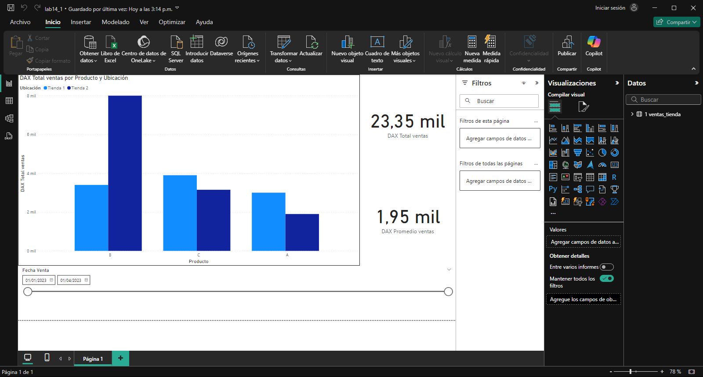

## Escenario 1: Análisis de Ventas de Productos en Tiendas

Se debe analizar las ventas de una cadena de tiendas que vende varios productos, y tienes datos
sobre:

- Producto vendido
- Cantidad vendida
- Precio unitario del producto
- Fecha de la venta
- Ubicación de la tienda

El objetivo será analizar el rendimiento de las ventas por producto, promedio de ventas, ventas por ubicación, y aplicar filtros interactivos.

## Paso a Paso: Crear un Informe en Power BI

## Conclusión

El análisis de ventas muestra que ciertos productos y ubicaciones generan mayores ingresos, permitiendo identificar productos exitosos y áreas de oportunidad. El promedio de ventas ayuda a entender el comportamiento de compra, y el análisis por tienda permite ajustar estrategias para mejorar el rendimiento en ubicaciones de menor desempeño. Los filtros interactivos facilitan la exploración de tendencias y permiten tomar decisiones informadas para maximizar las ventas.
