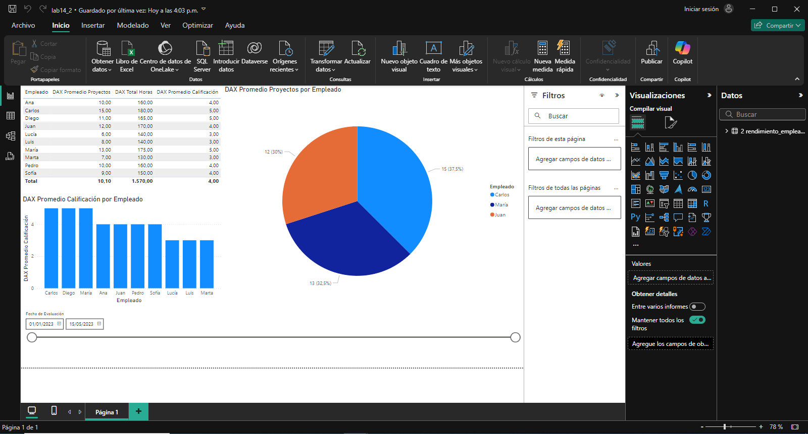

## Escenario 2: Análisis de Rendimiento de Empleados en una Empresa

Estas trabajando para el departamento de recursos humanos de una empresa, y necesitas
analizar el rendimiento de los empleados basado en el número de proyectos que han
completado, las horas trabajadas, y las calificaciones de rendimiento que han recibido.

## Paso a Paso: Crear un Informe en Power BI

## Conclusión

El análisis del rendimiento de empleados permite identificar a aquellos con alto desempeño mediante el número de proyectos completados, horas trabajadas y calificaciones recibidas. Esto ayuda a reconocer talento destacado, optimizar la asignación de proyectos y enfocar estrategias de desarrollo y capacitación para mejorar el rendimiento general del equipo.

[Escenario 1](../lab14_1)

[Escenario 3](../lab14_3)
