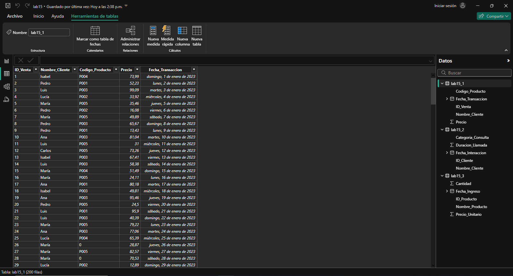

## Escenario 1: datos de ventas en línea

Se tiene un conjunto de datos de una empresa de ventas online que contiene información de clientes, productos vendidos y fechas de transacciones. El archivo tiene problemas comunes como valores faltantes en la columna de códigos de productos, precios con formato incorrecto y nombres de clientes en mayúsculas y minúsculas mezcladas.

## Paso a paso para la limpieza

## Conclusiones

La limpieza de datos en este conjunto permite corregir valores faltantes en códigos de productos, estandarizar precios y uniformar nombres de clientes. Esto mejora la calidad de la información, facilitando análisis más precisos y confiables sobre clientes, productos y transacciones.

[Laboratorio 15](../../lab15)

[Escenario 2](../lab15_2)
