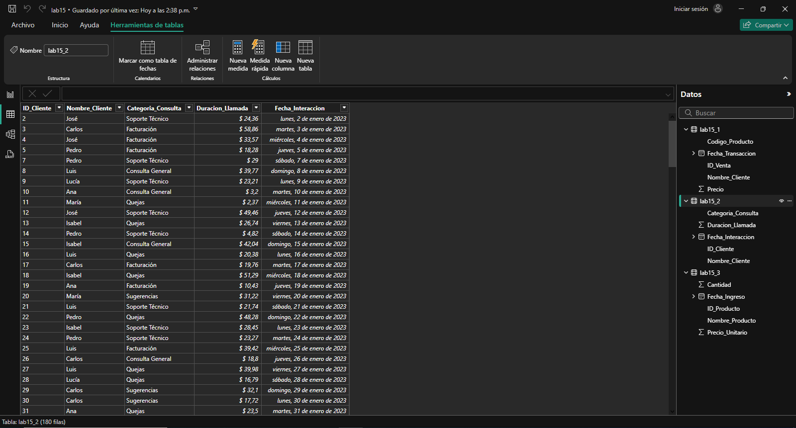

## Escenario 2:  Limpieza de datos de un servicio de atención al cliente

Trabajas en un centro de atención al cliente y tienes un conjunto de datos que contiene información sobre las interacciones con los clientes. Este dataset incluye el ID del cliente, Nombre del cliente, Categoría de consulta, Duración de la llamada y Fecha de la interacción. Algunos registros tienen problemas como nombres en minúsculas y mayúsculas inconsistentes, valores faltantes en la categoría de la consulta, y duraciones de llamada con errores de formato.

## Paso a paso para la limpieza

## Conclusiones

La limpieza de estos datos corrige inconsistencias en los nombres, completa categorías de consulta faltantes y estandariza la duración de las llamadas. Esto permite un análisis más claro y preciso de las interacciones, facilitando la mejora en la atención al cliente.

[Escenario 1](../lab15_1)

[Escenario 3](../lab15_3)
