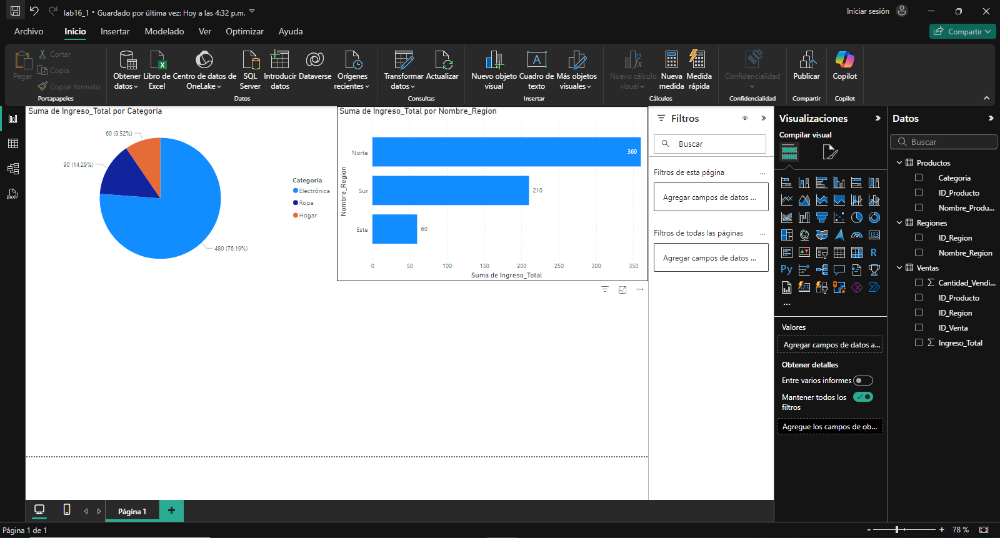
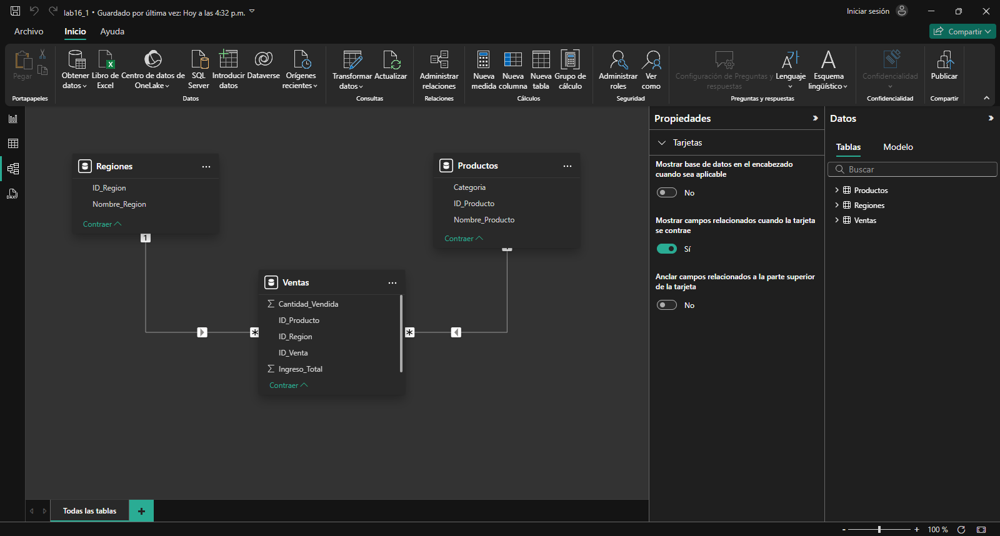

## Escenario 1

Gestionar en una tienda la venta de los productos en varias regiones y estás interesado en analizar las ventas por categoría de producto y región. Se tiene 3 tablas diferentes:

Ventas: Información sobre cada venta realizada, incluyendo el producto, la cantidad vendida y la región.

Productos: Lista de productos con su categoría.

Regiones: Información sobre las regiones en las que se realizan las ventas.

## Paso a paso para el modelado de datos y la visualización en Power BI

## Conclusiones

Al integrar y analizar estas tres tablas (Ventas, Productos y Regiones), puedes obtener un panorama claro de las ventas por categoría y región. Esto permite identificar las categorías de productos más vendidas en cada región, optimizar estrategias de venta y ajustar el inventario según la demanda regional.
