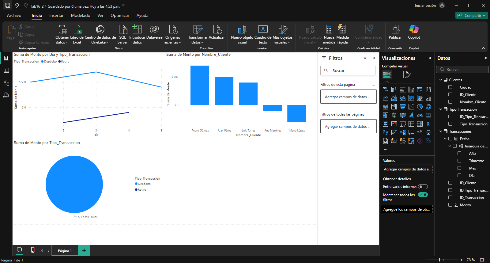
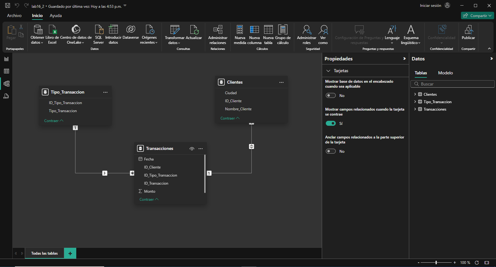

## Escenario 2

Se tiene un banco con información de los clientes, las transacciones que realizan (depósitos y retiros), y los tipos de transacción. El objetivo es analizar el comportamiento de las transacciones, categorizar las operaciones y visualizar los montos totales por tipo de transacción para cada cliente.

## Paso a paso para el modelado de datos y la visualización en Power BI

## Conclusiones

Al analizar los datos de clientes, transacciones y tipos de transacción, se puede entender mejor el comportamiento financiero de cada cliente. Esto permite categorizar las operaciones, visualizar los montos totales por tipo de transacción y detectar patrones de uso, facilitando decisiones estratégicas y personalización de servicios bancarios.

[Escenario 1](../lab16_1)

[Escenario 3](../lab16_3)
