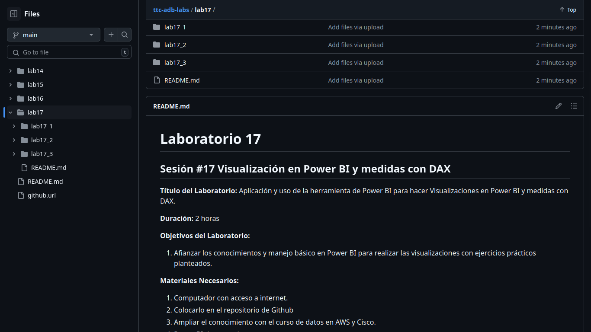

# Laboratorio 17

## Sesión #17 Visualización en Power BI y medidas con DAX

**Título del Laboratorio:** Aplicación y uso de la herramienta de Power BI para hacer Visualizaciones en Power BI y medidas con DAX.

**Duración:** 2 horas

**Objetivos del Laboratorio:**

1. Afianzar los conocimientos y manejo básico en Power BI para realizar las visualizaciones con ejercicios prácticos planteados.

**Materiales Necesarios:**

1. Computador con acceso a internet.
2. Colocarlo en el repositorio de Github
3. Ampliar el conocimiento con el curso de datos en AWS y Cisco.
4. Power BI descargarlo

**Estructura del Laboratorio:**

### Parte 1

En la primera parte se aplicarán los temas vistos en la sesión como es Visualizaciones en Power BI y medidas con DAX en los datos, se deberá realizar el paso a paso con las respetivas capturas de pantalla, esta aplicación es de acuerdo con los escenarios planteados. Realización de la unidad del curso de AWS o Cisco y anexar captura de pantalla del avance.

[Escenario 1](lab17_1)

[Escenario 2](lab17_2)

[Escenario 3](lab17_3)

