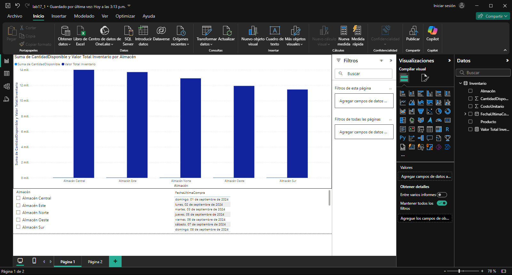

## Escenario 1: Gestión de Inventarios en una Empresa de Distribución

Una empresa de distribución gestiona un amplio inventario de productos en diferentes almacenes a lo largo del país. Para optimizar su operación y mejorar el proceso de reabastecimiento, desean implementar un sistema de análisis de inventarios en Power BI. Los datos disponibles incluyen información sobre los productos, los almacenes donde se almacenan, las cantidades disponibles y los costos por unidad.

#### Los datos tienen las siguientes columnas

- **Producto:** Nombre del producto.
- **Almacén:** Nombre del almacén donde se encuentra el producto.
- **Cantidad Disponible:** Cantidad actual disponible en stock.
- **Costo Unitario:** Costo por unidad del producto.
- **Fecha Ultima Compra:** Fecha de la última compra del producto.

El objetivo es analizar el estado de los inventarios para identificar productos con bajo stock, determinar el costo total del inventario por almacén, y visualizar las tendencias de reabastecimiento a lo largo del tiempo.

## Paso a paso

## Conclusión

Este análisis de inventarios en Power BI permite identificar productos con bajo stock y calcular el costo total del inventario en cada almacén, facilitando el control financiero. Al visualizar las tendencias de reabastecimiento a lo largo del tiempo, la empresa puede optimizar el proceso de reabastecimiento y mejorar la disponibilidad de productos en sus almacenes, asegurando una operación más eficiente y evitando faltantes.

[Laboratorio 17](../../lab17)

[Escenario 2](../lab17_2)
