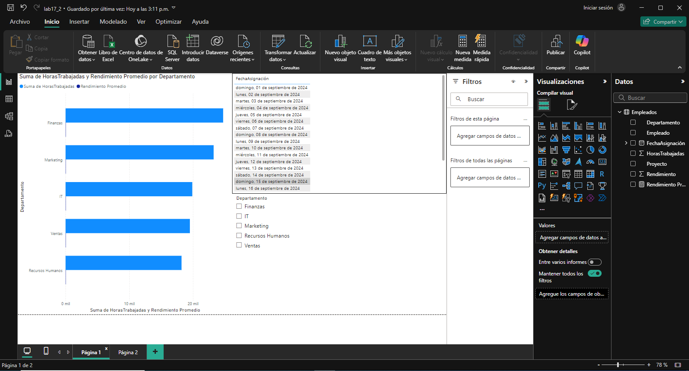
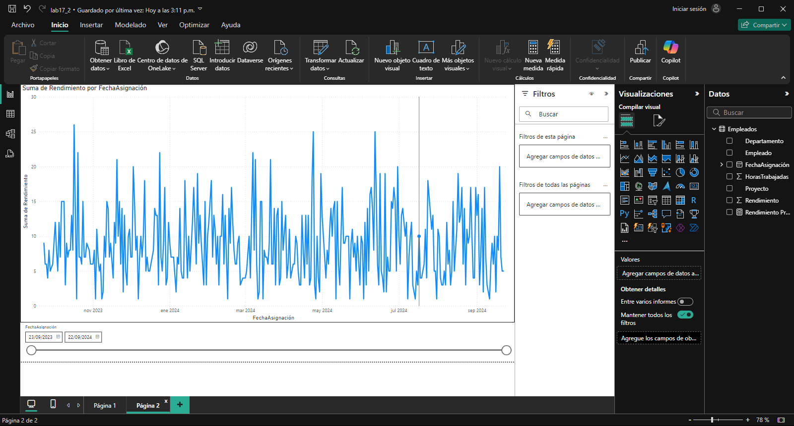

## Escenario 2: Análisis del Rendimiento de Empleados en una Empresa

Una empresa de tecnología desea analizar el rendimiento de sus empleados para identificar aquellos con mejor desempeño, las áreas que requieren capacitación y la productividad general de sus equipos. Para ello, cuentan con un conjunto de datos que contiene información sobre los empleados, los proyectos en los que han trabajado, las horas dedicadas y las evaluaciones de rendimiento.

#### Los datos tienen las siguientes columnas

- **Empleado:** Nombre del empleado.
- **Departamento:** Departamento al que pertenece el empleado (IT, Marketing, Ventas, Recursos Humanos, Finanzas).
- **Proyecto:** Nombre del proyecto asignado al empleado.
- **Horas Trabajadas:** Número de horas trabajadas en el proyecto.
- **Rendimiento:** Calificación de rendimiento del empleado en el proyecto (de 1 a 5).
- **Fecha Asignación:** Fecha en la que el empleado fue asignado al proyecto.

El objetivo es evaluar el rendimiento de los empleados en los diferentes proyectos y departamentos, identificar los empleados más productivos y detectar áreas que necesiten mejoras o capacitación adicional.

## Paso a paso

## Conclusiones

Este análisis de rendimiento permite identificar a los empleados más productivos y evaluar su desempeño por proyecto y departamento. Al revisar las calificaciones de rendimiento y las horas trabajadas, la empresa puede destacar talento, reconocer áreas que requieren capacitación y mejorar la productividad general de los equipos, optimizando la asignación de recursos y el desarrollo de habilidades.

[Escenario 1](../lab17_1)

[Escenario 3](../lab17_3)
