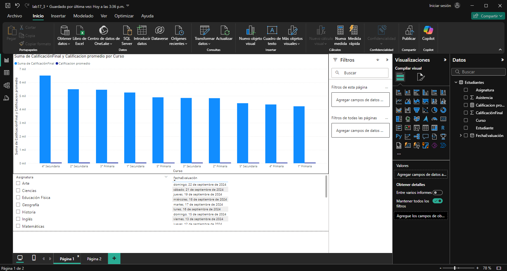
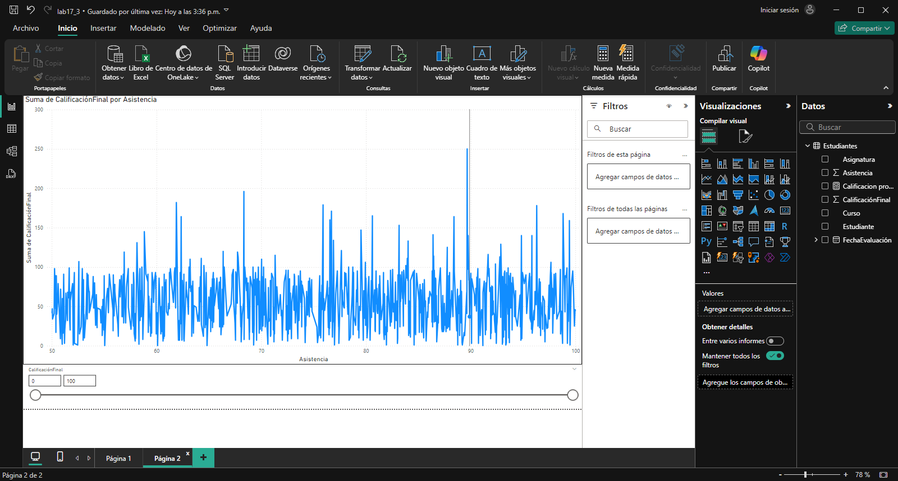

## Escenario 3: Análisis del Rendimiento Académico de Estudiantes en una Institución Educativa

Una institución educativa desea evaluar el rendimiento académico de sus estudiantes a lo largo del año para identificar áreas de mejora, asignaturas con baja tasa de aprobación y evaluar el desempeño general de los alumnos por curso y materia. También desean analizar la asistencia para correlacionarla con los resultados académicos.

#### Los datos tienen las siguientes columnas

- **Estudiante:** Nombre del estudiante.
- **Curso:** Curso en el que está inscrito (1° Primaria, 2° Primaria, hasta 5° Secundaria).
- **Asignatura:** Nombre de la asignatura (Matemáticas, Ciencias, Historia, Inglés.).
- **Calificación Final:** Calificación final del estudiante en la asignatura (de 0 a 100).
- **Asistencia:** Porcentaje de asistencia a clases (0 a 100).
- **Fecha Evaluación:** Fecha en la que se registró la calificación final.

El objetivo es evaluar el rendimiento académico de los estudiantes, identificar asignaturas con baja tasa de aprobación, analizar la relación entre asistencia y desempeño académico, y medir el rendimiento por curso y asignatura.

## Paso a paso

## Conclusiones

Este análisis académico permite evaluar el rendimiento de los estudiantes por curso y asignatura, identificando áreas y materias con baja tasa de aprobación. Al correlacionar asistencia y calificaciones, la institución puede comprender mejor el impacto de la asistencia en el desempeño y orientar estrategias de mejora en enseñanza y apoyo para elevar el rendimiento general de los alumnos.

[Escenario 2](../lab17_2)

[Laboratorio 17](../../lab17)
