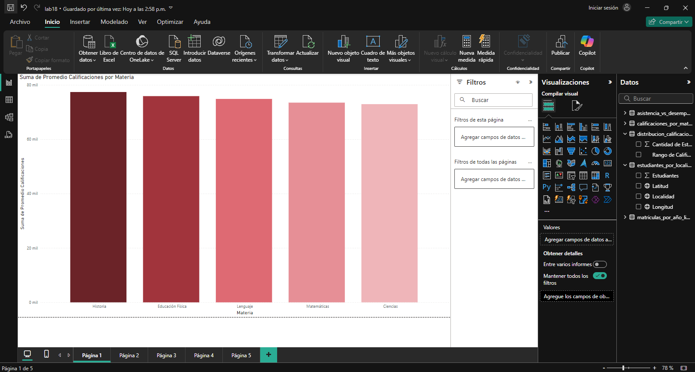

## Escenario 1

En el sector Educativo se aborda una serie de visualizaciones en Power BI que permiten analizar datos educativos desde distintas perspectivas. Estas visualizaciones incluyen gráficos de barras, gráficos de líneas, gráficos de dispersión, gráficos circulares y mapas. Cada visualización está diseñada para proporcionar una visión clara y detallada de áreas clave como el desempeño estudiantil, la evolución de las matrículas, la relación entre asistencia y calificaciones, la distribución de estudiantes por categorías y la ubicación geográfica de los estudiantes en una ciudad.

#### Se requiere lo siguiente:

1. **Comparación del Desempeño Estudiantil por Materia:** Ayudar a identificar áreas de mejora en el rendimiento académico de los estudiantes mediante el análisis de las calificaciones promedio por asignatura.

2. **Evolución de Matrículas Anuales:** Proporcionar una visión clara de las tendencias en las matrículas anuales de una universidad para entender cómo ha cambiado la población estudiantil en los últimos años.

3. **Relación entre Asistencia y Desempeño:** Evaluar cómo la asistencia a clases afecta el rendimiento académico, determinando si una mayor asistencia conduce a mejores calificaciones.

4. **Distribución de Calificaciones por Categoría:** Mostrar la proporción de estudiantes en distintos rangos de calificación, lo que permite a la administración universitaria entender mejor el rendimiento general de los estudiantes.

5. **Distribución Geográfica de Estudiantes:** Ayudar a visualizar la distribución geográfica de sus estudiantes en distintas localidades de Bogotá, permitiendo mejorar la planificación logística y las rutas de transporte.

#### Se aplicará los siguientes gráficos:

- **Gráfico de Barras – Comparación de Desempeño Estudiantil por Materia:** Se requiere analizar el desempeño promedio de los estudiantes en varias materias para identificar áreas de mejora. Las materias evaluadas incluyen Matemáticas, Ciencias, Historia, entre otras. **Propósito:** Facilitar la identificación de materias en las que los estudiantes tienen un bajo rendimiento para ajustar estrategias educativas. **Data:** `calificaciones_por_materia`

- **Gráfico de Líneas – Evolución de Matrículas Anuales:** Se requiere analizar el número de estudiantes matriculados en los últimos cinco años, con el objetivo de identificar tendencias de crecimiento o disminución en la inscripción. **Propósito:** Ayudar en la planificación de recursos y estrategias de admisión. **Data:** `matriculas_por_año`

- **Gráfico de Dispersión – Relación entre Asistencia y Desempeño:** Se busca entender la relación entre la asistencia a clases y el rendimiento académico de los estudiantes. Se quiere identificar si la asistencia regular tiene un impacto significativo en las calificaciones. **Propósito:** Evaluar si la asistencia a clases influye en el rendimiento académico y si se deben implementar políticas de asistencia más estrictas. **Data:** `asistencia_vs_desempeno.`

- **Gráfico Circular – Distribución de Calificaciones por Categoría:** Se requiere analizar la distribución de calificaciones entre los estudiantes, clasificando las notas en categorías (A, B, C, D, F). Esto ayudará a entender el nivel general de rendimiento académico en la institución. **Propósito:** Visualizar la proporción de estudiantes en cada rango de calificación y tomar decisiones sobre políticas educativas o programas de apoyo. **Data:** `distribucion_calificaciones`

- **Mapa – Distribución de Estudiantes por Localidades:** Se requiere analizar la distribución de sus estudiantes en las distintas localidades de Bogotá para mejorar la logística de transporte y la planificación de rutas. **Propósito:** Optimizar la distribución de recursos y mejorar la eficiencia del transporte. **Data:** `estudiantes_por_localidad`

## Paso a Paso

## Conclusiones

Estas visualizaciones en Power BI ofrecen una perspectiva completa y detallada del rendimiento y la distribución de los estudiantes, ayudando a la institución educativa a tomar decisiones estratégicas informadas:

- **Comparación de Desempeño Estudiantil por Materia (Gráfico de Barras):** Analiza el promedio de calificaciones por materia para identificar áreas de bajo rendimiento. Esto permite ajustar enfoques educativos en materias específicas, como Matemáticas o Ciencias, y mejorar el apoyo a los estudiantes en esas áreas.

- **Evolución de Matrículas Anuales (Gráfico de Líneas):** Monitorea la cantidad de matrículas en los últimos cinco años, mostrando las tendencias de inscripción. Esta visualización apoya la planificación de recursos, permitiendo a la universidad adaptar sus estrategias de admisión y prever el crecimiento o la disminución de estudiantes.

- **Relación entre Asistencia y Desempeño (Gráfico de Dispersión):** Examina cómo la asistencia influye en el rendimiento académico, ayudando a identificar si una mayor asistencia se traduce en mejores calificaciones. Con esta información, la administración puede considerar implementar políticas que incentiven la asistencia.

- **Distribución de Calificaciones por Categoría (Gráfico Circular):** Clasifica el rendimiento académico de los estudiantes en categorías (A, B, C, D, F), proporcionando una visión del nivel general de logro académico. Esta información permite evaluar si es necesario ofrecer programas de apoyo para estudiantes en las categorías más bajas.

- **Distribución Geográfica de Estudiantes (Mapa):** Visualiza la ubicación de los estudiantes en diferentes localidades de Bogotá, lo cual es esencial para mejorar la logística de transporte y la planificación de rutas. Con esto, la universidad puede optimizar sus recursos de transporte y planificar de manera más eficiente.

Cada visualización se centra en una métrica crítica, permitiendo una comprensión profunda de la dinámica estudiantil y facilitando una mejor toma de decisiones para optimizar los recursos y mejorar el rendimiento académico.
