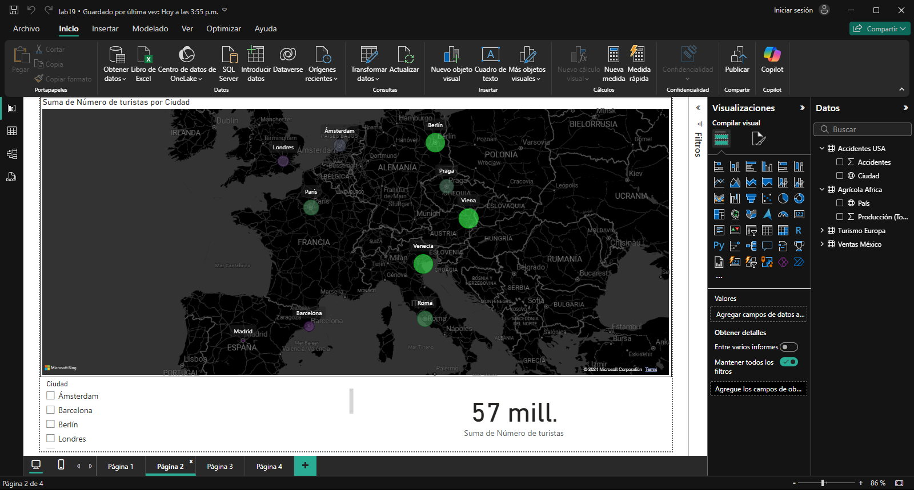

## Escenario 2: Análisis de Turismo en Europa

Se quiere analiza el turismo en las principales ciudades europeas. Se busca visualizar cuántos turistas visitaron las ciudades durante el último año y compararlas según el volumen de turistas.

**Datos:** `turismo_europa`

### Paso a paso

### Conclusión

Este análisis de turismo permite comparar las principales ciudades europeas en función del volumen de visitantes durante el último año. Al visualizar la cantidad de turistas, es posible identificar las ciudades más visitadas y aquellas con menor afluencia, facilitando decisiones estratégicas para impulsar el turismo en áreas con menor desempeño.

[Escenario 1](../lab19_1)

[Escenario 3](../lab19_3)
