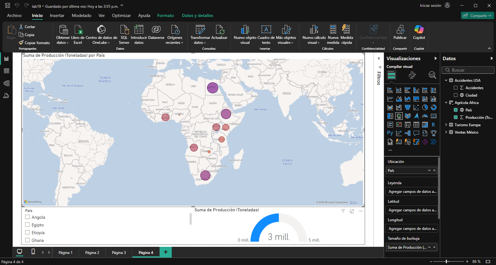

## Escenario 4: Análisis de Producción Agrícola en Países de África

Se busca analizar la producción agrícola de diferentes países africanos, con el objetivo de identificar las áreas con mayor producción y comparar los resultados entre países.

**Datos:** `produccion_agricola_africa`

### Paso a paso

### Conclusión

Este análisis de producción agrícola permite identificar los países africanos con mayor producción agrícola y comparar los resultados entre ellos. Al visualizar estos datos, se pueden detectar tendencias y áreas de oportunidad para mejorar la producción en países con menores rendimientos, lo que puede contribuir a la seguridad alimentaria y al desarrollo agrícola en la región.

[Escenario 3](../lab19_3)

[Laboratorio 19](../../lab19)
