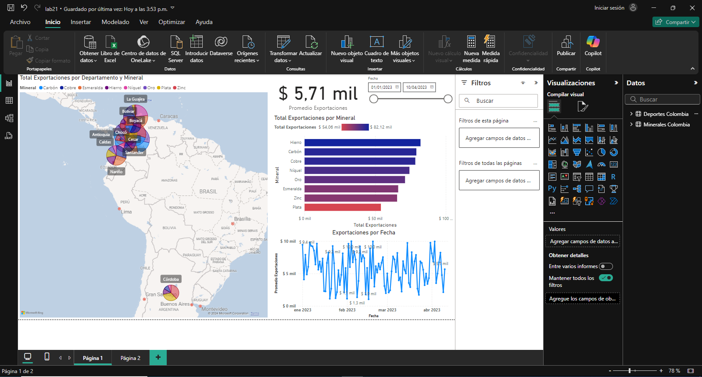

## Escenario 1: Sector de Minerales

En el sector de minerales, se tiene diferentes tipos de productos como oro, plata, carbón, esmeraldas y otros recursos naturales. Crear un dashboard que se enfoque en las exportaciones de minerales por región en Colombia, considerando factores como los volúmenes de producción y las ventas a lo largo del tiempo.

**Métricas:**

- Total, de ventas por tipo de mineral (oro, plata, carbón, esmeraldas, níquel).
- Distribución geográfica de las exportaciones por departamento (Antioquia, Boyacá, Chocó).
- Producción y exportación acumulada para identificar patrones a lo largo del tiempo.

**Data:** `exportaciones_minerales_colombia.xlsx`

## Paso a paso

## Concusión

De este dashboard podemos obtener información acerca del comportamiento de las exportaciones de minerales extraídos en Colombia, podemos ver que el hierro es el mineral con mayor exportaciones del país, y que en promedio las exportaciones en este campo son de 5.71 mil dólares al año.

[Laboratorio 21](../../lab21)

[Escenario 2](../lab21_2)
