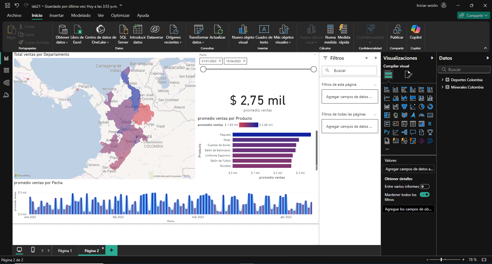

## Escenario 2: Sector Deportivo

En el sector deportivo, se tiene diferentes ventas de artículos deportivos por región, incluyendo productos como balones, uniformes, bicicletas, pesas. Se debe analizar cuáles productos tienen más demanda en las diferentes regiones de Colombia, y cómo varían las ventas a lo largo del tiempo.

**Métricas:**

- Total de ventas por tipo de artículo deportivo (balones de fútbol, bicicletas, pesas, uniformes).
- Ventas distribuidas por región (Bogotá, Antioquia, Valle del Cauca).
- Tendencias temporales de ventas, relacionadas con eventos deportivos o temporadas de alta demanda.

**Data:** `ventas_deportes_colombia.xlsx`

## Paso a paso

## Concusión

De este dashboard podemos extraer la información relevante acerca de las ventas de productos deportivos en Colombia, podemos ver como ese comportamiento promedio de las ventas en cada epoca del año como en su distribucion en las principales tiendas ubicadas en los departamentos mas importantes del país y podremos observar el comportamiento de los datos segmentados por fecha.

[Escenario 1](../lab21_1)

[Laboratorio 21](../../lab21)
