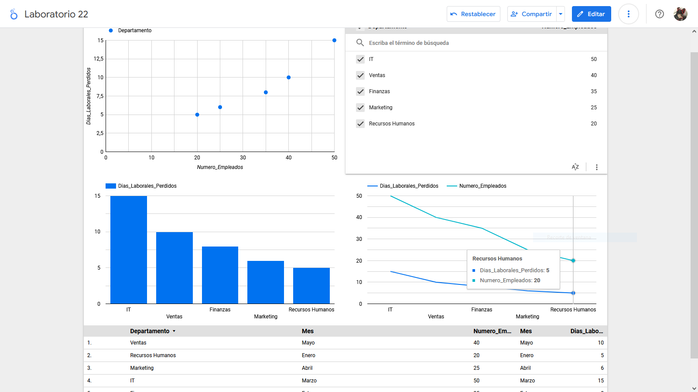

## Escenario 1: Gestión de Recursos Humanos (Ausentismo Laboral)

Una empresa desea analizar el índice de ausentismo laboral en los diferentes departamentos. La compañía quiere identificar patrones para implementar políticas que mejoren la asistencia de los empleados y aumentar la productividad. Se cuenta con los datos de las ausencias por mes, por departamento, y el número de días laborales perdidos.

**Data:** `ausentismo_laboral.csv`

### Pasos a paso

### Conclusión

Este análisis del índice de ausentismo laboral permite identificar patrones de ausencias en los distintos departamentos, ayudando a detectar áreas con alta incidencia de ausencias. Con esta información, la empresa puede implementar políticas específicas para mejorar la asistencia y, en consecuencia, aumentar la productividad general.
