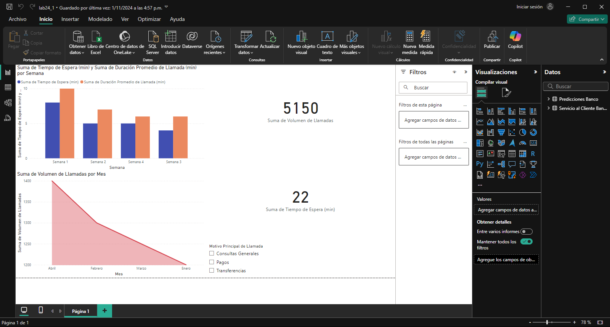

## Escenario 1: Optimización del Servicio al Cliente en un Banco

Un banco está buscando mejorar la satisfacción y lealtad de sus clientes. Han recopilado datos de interacciones en su centro de atención al cliente, incluidos tiempos de espera, duración de las llamadas y motivos de consulta.

- **Insight Descriptivo:** Al analizar los datos históricos, el banco observa que los tiempos de espera son más largos durante la primera semana del mes, lo cual coincide con los días de mayor volumen de llamadas debido a temas de pagos y transferencias.

- **Insight Diagnóstico:** Descubren que las consultas relacionadas con transferencias y pagos son las que más tiempo requieren de atención. Esto se debe a que los clientes solicitan frecuentemente detalles adicionales sobre transacciones recientes.

- **Insight Predictivo:** Basado en el patrón histórico, predicen que el volumen de llamadas aumentará un 30% al inicio del mes siguiente, lo que permitirá al banco asignar más personal durante esos días críticos.

- **Insight Prescriptivo:** Para reducir tiempos de espera y mejorar la experiencia del cliente, el banco decide implementar un sistema automatizado de respuestas para consultas comunes sobre transferencias y pagos, lo que liberará a los agentes para manejar casos más complejos.

**Data:** `Data _banco_supermercado.xlsx`

### Paso a paso

### Conclusiones

En este caso, el banco usa análisis descriptivo, diagnóstico, predictivo y prescriptivo para optimizar su servicio al cliente:

- **Insight Descriptivo:** Identifica que los tiempos de espera aumentan al inicio de cada mes debido a un mayor volumen de llamadas por temas de pagos y transferencias.

- **Insight Diagnóstico:** Concluye que las consultas sobre transferencias y pagos toman más tiempo, ya que requieren detalles adicionales.

- **Insight Predictivo:** Predice un aumento del 30% en llamadas para el inicio del próximo mes, permitiéndoles planificar mejor el personal disponible.

- **Insight Prescriptivo:** Implementa un sistema automatizado para preguntas frecuentes, lo que permite a los agentes enfocarse en consultas más complejas, mejorando la satisfacción y lealtad del cliente.

Estos insights permiten al banco mejorar proactivamente su gestión de recursos y la experiencia del cliente en momentos de alta demanda.

[Laboratorio 24](../../lab24)

[Escenario 2](../lab24_2)