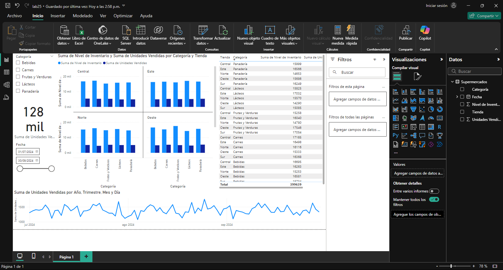

## Escenario 1: Optimización de Inventarios en una Cadena de Supermercados

Una cadena de supermercados quiere optimizar su inventario para reducir costos y mejorar la disponibilidad de productos. El equipo de análisis de datos debe generar un informe que identifique qué productos tienen mayor rotación en cada tienda y cuáles tienden a acumularse sin venderse.

Con base en esta información, los gerentes pueden tomar decisiones sobre los niveles de stock óptimos y desarrollar estrategias de reabastecimiento específicas por ubicación. Además, el informe puede incluir patrones estacionales para ajustar los inventarios en función de la demanda esperada en diferentes épocas del año.

Debes definir el objetivo del Informe, el publico que va dirigido, los KPIs.

Debes realizar la recopilación y preparación de los datos (fuente: `escenario_supermercados.xlsx`, limpieza y trasformación).

Debes hacer el análisis de datos (descriptivo, visualización, exploración)

Debes hacer la interpretación de los resultados (Tendencia, comparación de KPIs)

Debes generar el informe (resumen ejecutivo, resultados y análisis, recomendaciones, conclusiones)

Debes contar el proceso de revisión y validación (verificar los datos, la retroalimentación, validación del objetivo).

## Resumen ejecutivo

El conjunto de datos está listo para el análisis, con las siguientes observaciones clave:

- **Nivel de Inventario:** Rango de 50 a 300 unidades por categoría y tienda.

- **Unidades Vendidas:** Promedio de 55 unidades vendidas, con variabilidad notable.

- **Rotación:** La rotación promedio es de 0.4, lo que indica que en promedio se vende el 40% del inventario disponible en cada periodo.

Dado que no hay problemas con los datos de fecha y la rotación está calculada, el siguiente paso será:

**Análisis Descriptivo:** Calcular promedios de rotación por tienda y categoría.

**Estacionalidad:** Examinar la tendencia de ventas a lo largo del año.

## Resultados del Análisis

### Rotación de Inventario por Tienda y Categoría:

Las categorías con mayor rotación varían entre tiendas, pero en promedio:
- Frutas y Verduras muestra una alta rotación en la tienda Norte (0.46) y Central (0.41).
- Panadería presenta una rotación notable en la tienda Oeste (0.44) y Norte (0.44).
- Carnes tiene la mayor rotación en la tienda Oeste (0.43).

### Tendencias Estacionales:

Las ventas tienden a ser constantes en los meses de julio (43,057 unidades) y agosto (42,966 unidades), con una ligera disminución en septiembre (41,803 unidades).

Esto sugiere una demanda estable en estos meses, lo cual podría influir en el ajuste de inventarios para evitar sobrestock o desabastecimiento.

## Recomendaciones Basadas en los Resultados

### Ajuste de Inventarios:

Para tiendas con alta rotación en categorías específicas, se recomienda aumentar ligeramente el inventario de estas categorías en meses de alta demanda (julio y agosto).

En tiendas con menor rotación en ciertas categorías, considerar estrategias para reducir niveles de inventario o incentivar ventas para evitar acumulación.

### Gestión Estacional:

Mantener niveles de stock similares para los meses de julio y agosto. En septiembre, se podría reducir el inventario de categorías con menor rotación para optimizar costos.

## Conclusiones

Este análisis ayuda a establecer niveles de inventario óptimos y detectar tendencias estacionales, permitiendo a la cadena de supermercados mejorar su gestión de inventarios y adaptarse a la demanda. Esto debería conducir a una reducción de costos y una mejor disponibilidad de productos en cada tienda.

[Laboratorio 25](../../lab25)