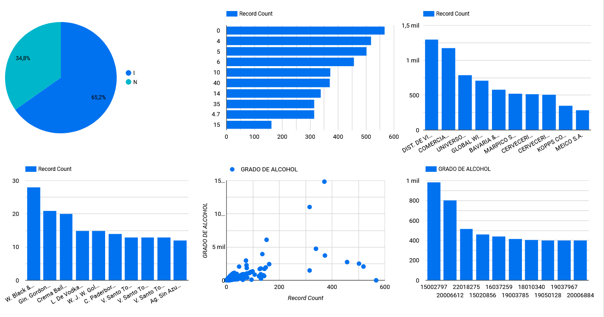

# Laboratorio 28

## Sesión #28 Visualización y generación del informe de Datos

**Título del Laboratorio:** Visualización y generación del informe de los datos de los productos de licor registrados en Risaralda para la distribución.

**Duración:** 2 horas

**Objetivos del Laboratorio:**

1. Utilizar Looker Studio para crear visualizaciones claras y efectivas que permitan analizar el dataset y documentar un informe detallado, destacando hallazgos clave y recomendaciones basadas en datos.

**Materiales Necesarios:**

1. Computador con conexión a internet.
   
2. Herramientas de visualización Looker estudio.

**Estructura del Laboratorio:**

1. Se deberá entregar un informe escrito que detalle el paso a paso, debe incluir las observaciones, los hallazgos, conclusiones y recomendaciones, se debe entregar en PDF o Word.

2. Responder las preguntas planteadas.

   - ¿Cuál es la distribución de los productos según su origen (Nacional vs. Importado), y cómo afecta esto la estrategia de distribución?

   - ¿Cómo se distribuyen los grados de alcohol entre los diferentes productos, y cuáles categorías representan un mayor o menor riesgo en términos de regulación y aceptación de mercado?

   - ¿Cuántos productos tienen registros sanitarios próximos a expirar o vencidos, y qué acciones se deben priorizar para mantener el cumplimiento con las normativas del INVIMA?

   - ¿Qué productores tienen la mayor cantidad de productos en riesgo de vencimiento del registro sanitario, y cómo afecta esto la planificación para el cumplimiento normativo?

3. Adjunta el Dataset, los scripts, archivo de las visualizaciones.

[Enlace a Dataset](producto_licores_limpio.csv)

[Enlace a script de python](lab26.py)

