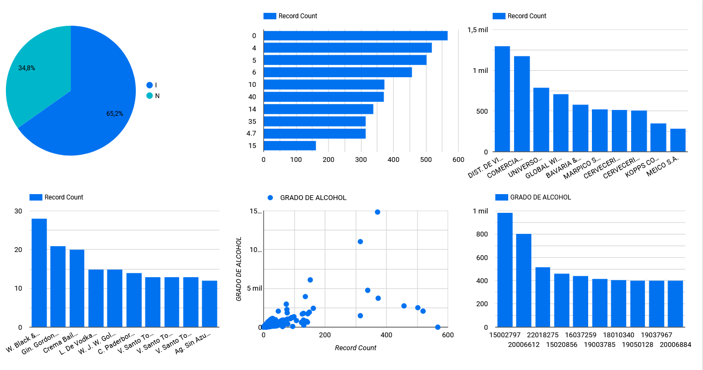

# Laboratorio 28

## Sesión #28 Visualización y generación del informe de Datos

**Título del Laboratorio:** Visualización y generación del informe de los datos de los productos de licor registrados en Risaralda para la distribución.

**Duración:** 2 horas

**Objetivos del Laboratorio:**

1. Utilizar Looker Studio para crear visualizaciones claras y efectivas que permitan analizar el dataset y documentar un informe detallado, destacando hallazgos clave y recomendaciones basadas en datos.

**Materiales Necesarios:**

1. Computador con conexión a internet.
   
2. Herramientas de visualización Looker estudio.

**Estructura del Laboratorio:**

1. Se deberá entregar un informe escrito que detalle el paso a paso, debe incluir las observaciones, los hallazgos, conclusiones y recomendaciones, se debe entregar en PDF o Word.

    - Se eliminaron filas en las que haya valores nulos en columnas críticas: [`ORIGEN`, `PRODUCTO`, `GRADO DE ALCOHOL`, `REGISTRO SANITARIO`].
    - Se cambiaron valores nulos en `NOMBRE EMPRESA DISTRIBUIDORA` a `Desconocido`.
    - Se eliminaron duplicados.
    - Se realizaron gráficas en Google Looker con los datos limpios.

2. Responder las preguntas planteadas.

    - ¿Cuál es la distribución de los productos según su origen (Nacional vs. Importado), y cómo afecta esto la estrategia de distribución?

        *34.8% de origen nacional y 65.2% de origen importado. Esta distribución permitirá entender qué parte del inventario es importado y cuál es nacional, lo que influye en los tiempos y costos de logística. Una mayor proporción de productos nacionales podría sugerir menos dependencia de importaciones y costos logísticos más bajos.*
   
    - ¿Cómo se distribuyen los grados de alcohol entre los diferentes productos, y cuáles categorías representan un mayor o menor riesgo en términos de regulación y aceptación de mercado?
    
        *La mayoría de bebidas tienen un grado de alcohol menor de 2.5 mil. Los productos con un grado de alcohol muy alto pueden tener mayores restricciones regulatorias y una audiencia más limitada. Identificar estas categorías permite tomar decisiones sobre comercialización y cumplimiento normativo.*
    
    - ¿Cuántos productos tienen registros sanitarios próximos a expirar o vencidos, y qué acciones se deben priorizar para mantener el cumplimiento con las normativas del INVIMA?
    
        *No se pudo analizar las fechas en Google Looker*

   - ¿Qué productores tienen la mayor cantidad de productos en riesgo de vencimiento del registro sanitario, y cómo afecta esto la planificación para el cumplimiento normativo?
   
        *No se pudo analizar las fechas en Google Looker*

3. Adjunta el Dataset, los scripts, archivo de las visualizaciones.

[Enlace a Dataset](../lab27/Productos_licores_limpio.csv)

[Enlace a script de python](../lab27/lab27.py)

