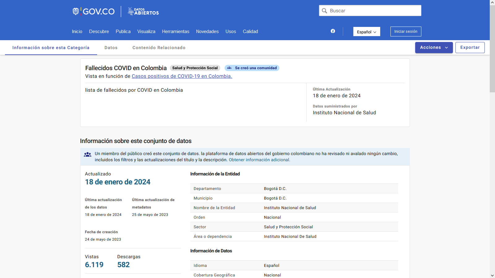

# Laboratorio 32

## Sesión #32 Carga y Exploración de Datos

**Título del Laboratorio:** Carga y Exploración de Datos de Fallecidos por COVID en Colombia.

**Duración:** 2 horas

**Objetivos del Laboratorio:**

1. Realizar un análisis exhaustivo de los datos relacionados con los Fallecidos por COVID en Colombia.
2. El análisis busca proporcionar insights que revelen oportunidades de mejora para el sector salud.

**Materiales Necesarios:**

1. Computador con conexión a internet.
2. Dataset confiable de https://www.datos.gov.co
3. Herramienta (Power BI)

**Estructura del Laboratorio:**

1. Realizar el cargue del Dataset y explorar la información, generación de un informe que describa: detalle el paso a paso, debe incluir las observaciones, los hallazgos, conclusiones y recomendaciones, se debe entregar en PDF o Word.

2. Formulación de las preguntas iniciales para guiar el análisis, responderlas.

   - ¿Cuáles fueron los grupos demográficos más afectados por el COVID-19 en términos de mortalidad?
   
      *Las personas adulto mayor fueron los más afectados.*
   
   - ¿Cómo varió el número de fallecimientos a lo largo del tiempo, y qué factores podrían haber contribuido a los picos observados?
   
      *Entre 2022 y 2023 los picos fueron bastante altos, porque con el tiempo la pandemia se fue expandiendo.*
   
   - ¿Cuáles son las principales recomendaciones para mejorar la respuesta a futuras crisis sanitarias basadas en el análisis de mortalidad por COVID-19?
   
      *Proteger y vacunar a los adultos mayores.*

3. Adjunta el archivo del dataset, los archivo de exploracion y se realizan visualizaciones.

[Enlace a archivo del dataset comprimido](Fallecidos_COVID_Colombia.zip)
