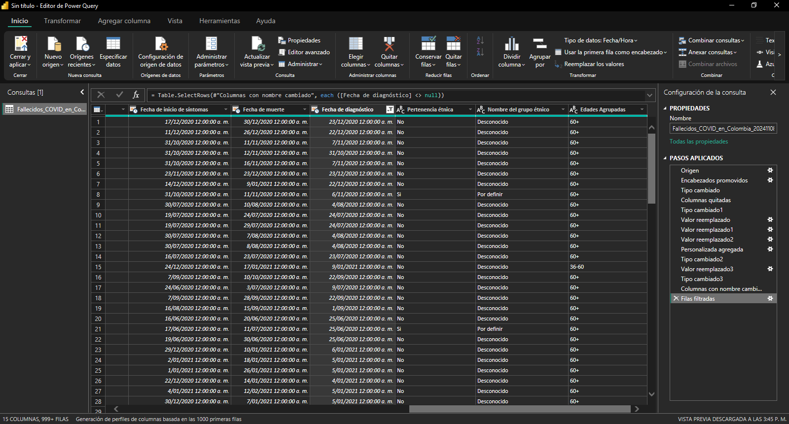

# Laboratorio 33

## Sesión #33 Exploración, Limpieza de los datos

**Título del Laboratorio:** Exploración, Limpieza de los datos de los fallecidos por COVID en Colombia.

**Duración:** 2 horas

**Objetivos del Laboratorio:**

1. Desarrollar habilidades en la exploración y limpieza de datos utilizando la herramienta de Power BI, para asegurar que el conjunto de datos esté preparado para análisis posteriores.

**Materiales Necesarios:**

1. Computador con conexión a internet.
2. Dataset confiable de https://www.datos.gov.co
3. Herramientas de limpieza Power BI.

**Estructura del Laboratorio:**

1. Realizar la limpieza del Dataset y usando la herramienta de Power BI (revisar la estructura del dataset, identificando valores nulos o inconsistencias).

2. Generar un Informe detallado de Resultados de la Limpieza, donde incluya: Introducción, descripción del Dataset, Proceso de Limpieza de Datos, Problemas Identificados y Soluciones Propuestas y las Conclusiones.

3. Archivos de Trabajo: archivos de limpieza en Power BI, bien documentado y con explicaciones claras.

## Informe

### Introducción

En este informe se detalla los pasos a seguir que se usaron para la limpieza de el dataset en Power BI.

### Descripción

El dataset tiene 133125 filas, cada una correspondiente a un conjunto de datos relacionados con las siguientes columnas: [fecha reporte web, ID de caso, Fecha de notificación, Código DIVIPOLA departamento, Nombre departamento, Código DIVIPOLA municipio, Nombre municipio, Edad, Unidad de medida de edad, Sexo, Tipo de contagio, Ubicación del caso, Estado, Código ISO del país, Nombre del país, Recuperado, Fecha de inicio de síntomas, Fecha de muerte, Fecha de diagnóstico, Fecha de recuperación, Tipo de recuperación, Pertenencia étnica, Nombre del grupo étnico]


### Proceso de limpieza de datos

1. Se eliminaron columnas no requeridas para el análisis, estas son: [Código DIVIPOLA departamento, Código DIVIPOLA municipio, Unidad de medida de edad, Código ISO del país, Recuperado, Fecha de recuperación, Tipo de recuperación]. El criterio que se usó para eliminar esas columnas, es que la información siempre era constante o es una columna repetida.

2. Se cambió `null` por "Desconocido" en la columna Nombre del grupo étnico.

3. Se eliminaron filas que tenian valores nulos.

4. Con un filtro, se ocultaron filas que podrían tener valores nulos.

### Problemas identificados

No se podía graficar la edad, porque son muchos valores y la gráfica no sería comprensible.

### Soluciones propuestas

Crear una columna en la que agrupe la edad en los siguientes rangos: ["0-18", "19-35", "36-60", "60+", "Sin Especificar"].

Para asignar esos valores correctamente, se utilizó un código en *Columna personalizada* y se le llamó "Edades Agrupadas".

Código:

```python
= if [Edad] >= 0 and [Edad] <= 18 then "0-18"
  else if [Edad] > 18 and [Edad] <= 35 then "19-35"
  else if [Edad] > 35 and [Edad] <= 60 then "36-60"
  else if [Edad] > 60 then "60+"
  else "Sin Especificar"
```



### Conclusiones

La limpieza de datos es una tarea fundamental en el proceso de análisis de datos porque asegura que la información sea consistente y tenga un formato uniforme que facilite la visualización y el análisis.
