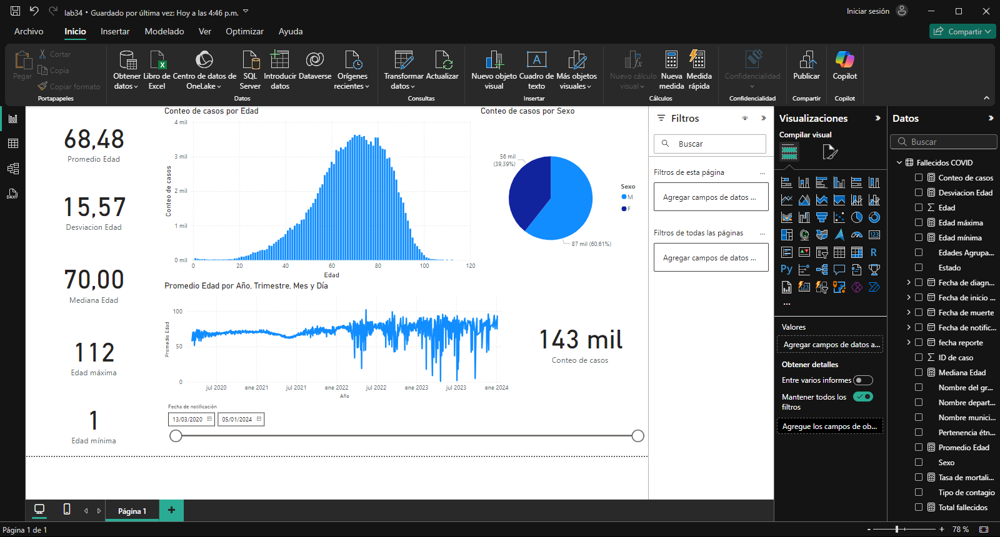

# Laboratorio 34

## Sesión #34 Estadística descriptiva de los datos

**Título del Laboratorio:** Estadística descriptiva de los datos de los datos fallecidos por COVID en Colombia.

**Duración:** 2 horas

**Objetivos del Laboratorio:**

1. Desarrollar habilidades en la analítica de estadística descriptiva utilizando la herramienta de Power BI, para asegurar que el conjunto de datos esté preparado para análisis posteriores.

**Materiales Necesarios:**

1. Computador con conexión a internet.
2. Dataset confiable de https://www.datos.gov.co
3. Herramientas de Power BI.

**Estructura del Laboratorio:**

1. Crear Visualizaciones Básicas con los filtros correspondientes, introduce las fórmulas DAX para obtener las estadísticas deseadas.

    - **Distribución por Género:** Crea un gráfico de barras o pastel que muestre la distribución de los fallecidos por género.
    - **Distribución por Edad:** Utiliza un gráfico de barras o histograma para mostrar la distribución de fallecidos por grupos de edad.
    - **Fallecimientos por Región:** Muestra un gráfico de barras con el número de fallecimientos en cada región o departamento.
    - **Fallecimientos por Fecha:** Usa un gráfico de líneas para visualizar cómo han evolucionado los fallecimientos a lo largo del tiempo.
    
    

2. Realizar un Informe detallado de resultados de la aplicación de la estadistica descriptiva donde incluya: Introducción, descripción del Dataset, Problemas Identificados y Soluciones Propuestas y las Conclusiones.

3. Archivos de Trabajo: archivos de Estadistica descriptiva en Power BI, bien documentado y con explicaciones claras.

## Informe

### Introducción

En este informe se hace un análisis descriptivo de los casos de muerte de COVID-19 en Colombia.

### Descripción del dataset

El dataset tiene 133125 filas, cada una correspondiente a un conjunto de datos relacionados con las siguientes columnas: [fecha reporte web, ID de caso, Fecha de notificación, Nombre departamento, Nombre municipio, Edad, Sexo, Tipo de contagio, Ubicación del caso, Estado, Nombre del país, Fecha de inicio de síntomas, Fecha de muerte, Fecha de diagnóstico, Pertenencia étnica, Nombre del grupo étnico]

### Problemas identificados

No se podía graficar la edad, porque son muchos valores y la gráfica no sería comprensible.

### Soluciones propuestas

Crear una columna en la que agrupe la edad en los siguientes rangos: ["0-18", "19-35", "36-60", "60+", "Sin Especificar"].

Para asignar esos valores correctamente, se utilizó un código en *Columna personalizada* y se le llamó "Edades Agrupadas".

Código:

```python
= if [Edad] >= 0 and [Edad] <= 18 then "0-18"
  else if [Edad] > 18 and [Edad] <= 35 then "19-35"
  else if [Edad] > 35 and [Edad] <= 60 then "36-60"
  else if [Edad] > 60 then "60+"
  else "Sin Especificar"
```

### Conclusiones

Se puede concluir que los adultos mayores son los que tienen más riesgo de muerte en caso de estar contagiado de COVID-19.

[Enlace a archivo de visualizaciones de Power BI](lab34.pbix)
