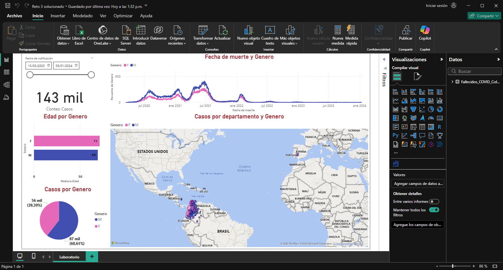
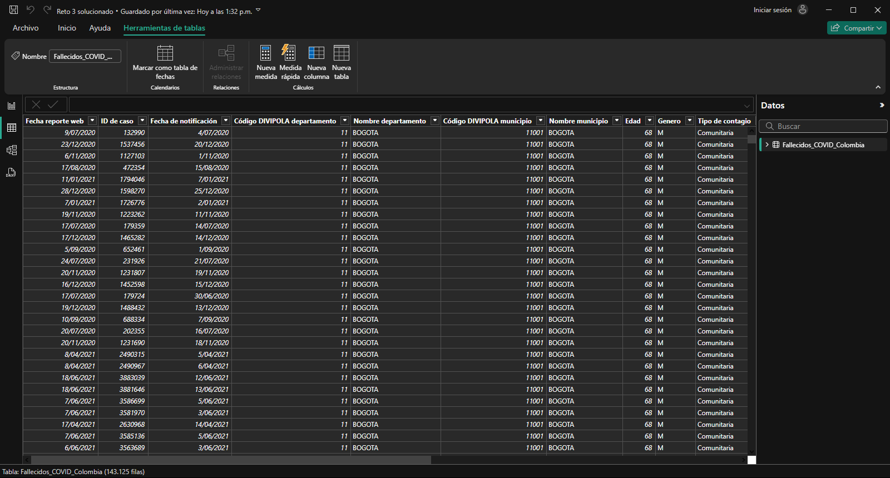

# Laboratorio 35

## Sesión #35 Visualización y generación del informe

**Título del Laboratorio:** Visualización y generación del informe de los datos de los fallecidos por COVID en Colombia.

**Duración:** 2 horas

**Objetivos del Laboratorio:**

1. Desarrollar habilidades en la creación de visualizaciones (Dasboards) usando la herramienta de Power BI y la documentación del informe.

**Materiales Necesarios:**

1. Computador con conexión a internet.
2. Dataset confiable de https://www.datos.gov.co
3. Herramientas de visualización Power BI.

**Estructura del Laboratorio:**

1. Crear visualizaciones interactivas por medio de dashboards que me muestre: Sexo, Sexo y fecha de muerte, Sexo y Edad, Sexo y Nombre Departamento, Fallecidos por Fecha de Muerte y realizar la interpretación y describirla según los datos observados.

2. Generar un informe escrito que detalle el paso a paso, debe incluir las observaciones, los hallazgos, conclusiones y recomendaciones, se debe entregar en PDF o Word.

3. Brindar respuesta a las preguntas formuladas.

    - ¿Cuáles fueron las principales tendencias en las tasas de fallecimientos por COVID-19 a lo largo del tiempo?
    
        Las muertes por COVID-19 fueron más altas entre Julio de 2020 y Julio de 2021.
    
    - ¿Qué regiones o departamentos presentaron las tasas más altas de mortalidad?
    
        Bogotá y la región pacifico.
    
    - ¿Cómo influyeron factores como la edad, el género y las comorbilidades en las tasas de mortalidad?
    
        Los adultos mayores tuvieron más muertes por COVID-19 y de esos los hombres tuvieron más muertes que las mujeres.
    
    - ¿Hubo picos específicos de mortalidad durante el tiempo analizado y a qué se debieron?

        Sí, por la etapa temprana de la pandemia, no había vacunas.
    
4. Adjunta el Dataset, los scripts, archivo de las visualizaciones. 

    
    
    
